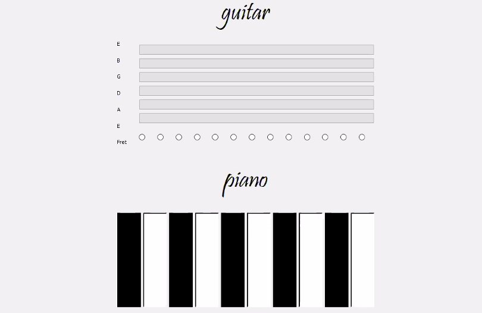

# Problem3: musical instruments

in this application we tried to make a guitar and piano instruments.

To play the guitar you should choose the fret  and then play the strings you want.

To  play the piano just click on the buttons to play the sounds.